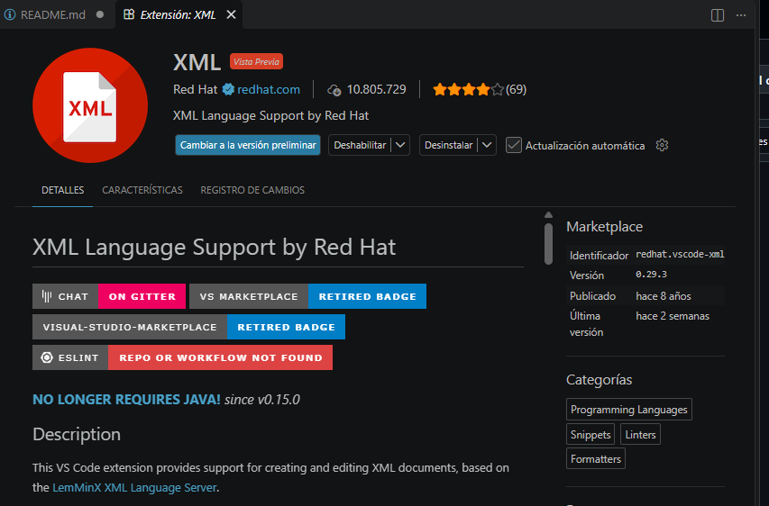
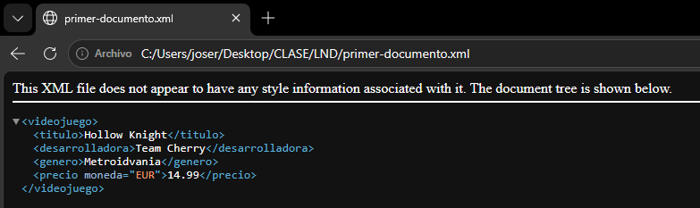

# Sesión 1. Introducción práctica a XML

## 1. Preparación del entorno

He instalado la extensión **XML de Red Hat** para disponer de resaltado,
formateo y detección de errores en Visual Studio Code.



## 2. Investigación inicial

1. XML es un lenguaje de marcas que sirve para almacenar datos y estructurarlos de manera legible tanto como para humanos como para la máquina.
2. Es un lenguaje extensible porque no tiene un formato predefinido y se puede personalizar como el cliente necesite o máquina procese.
3. XML es está diseñado para almacenar y estructurar datos pero en cambio html está creado para presentar y visualizar los datos en el navegador web.
4. Intercambios de datos y uso de APIs, configurar, almacenar información y el desarrollo de webs.
5. Cuando un documento es legible por personas y máquinas significa que la estructura de los datos es tanto legible por el idioma de la persona y por una estructura jerárquica estricta para la máquina pueda entender en sus programas dicha información.
6. Los archivos XML son archivos planos que no gestionan automáticamente la concurrencia, la indexación eficiente ni la integridad transaccional necesaria para múltiples usuarios simultáneos.

### Fuentes consultadas
 - [Fuente sobre las bases de datos en XML](https://ayudaleyprotecciondatos.es/bases-de-datos/xml/)
 - [Fuente sobre las funciones de XML](https://aws.amazon.com/es/what-is/xml/)
 
## 3. Mi primer documento XML



1. Bloque de código en XML
```xml
<?xml version="1.0" encoding="UTF-8"?>
<videojuego>
  <titulo>Hollow Knight</titulo> 
  <desarrolladora>Team Cherry</desarrolladora>
  <genero>Metroidvania</genero>
  <precio moneda="EUR">14.99</precio>
</videojuego>
```
2. El elemento raiz es "videojuego"
3. Los principales elementos existentes en dicho código son:
videojuego, titulo con su respectivo titulo, desarrolladora, genero y precio.
4. El atributo es "moneda" que le da el valor al precio en EUR.
5. Videojuego es la etiqueta padre y el titulo es la etiqueta hijo que está dentro de videojuego.
6. Titulo, desarrolladora, genero y precio son elementos hermanos.


